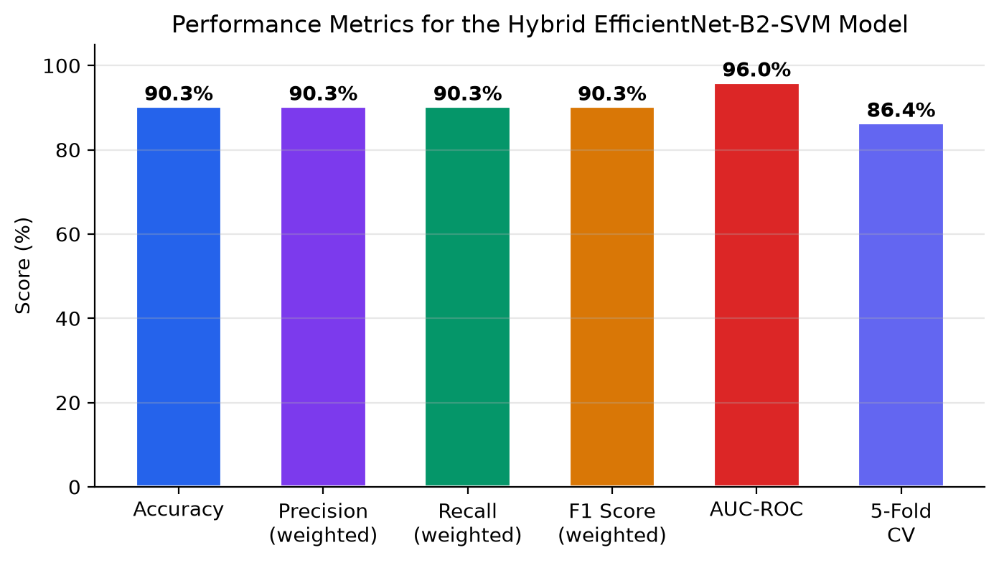
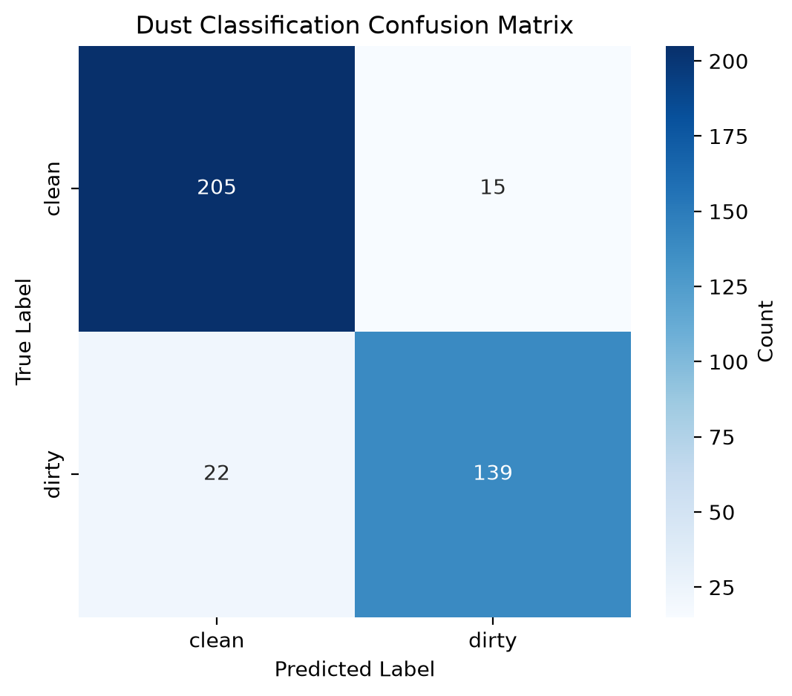
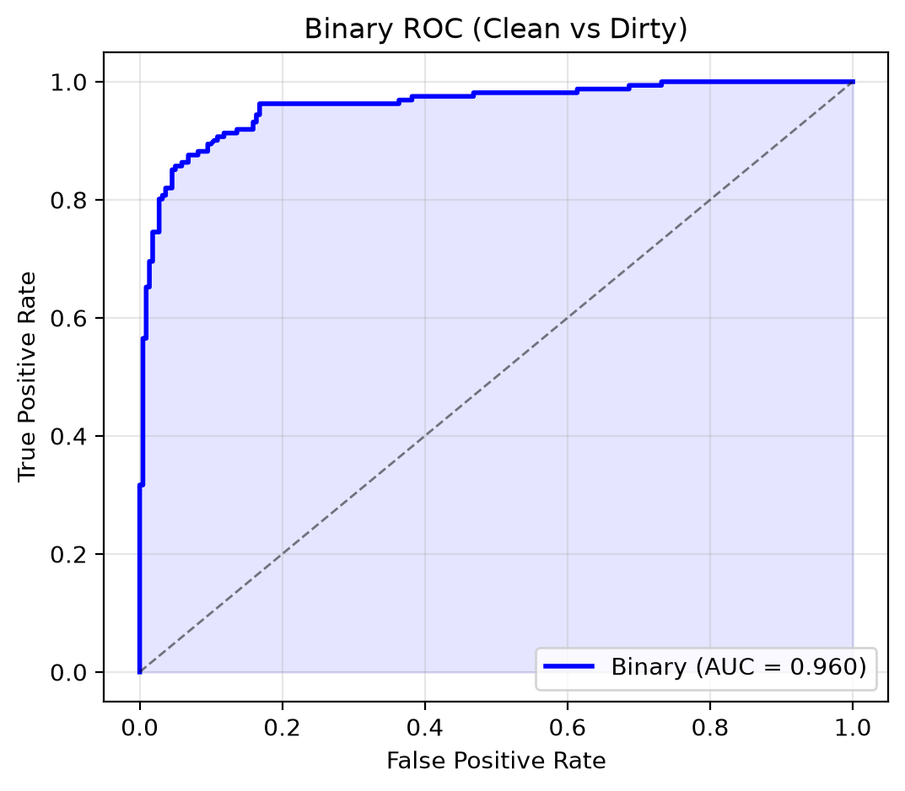
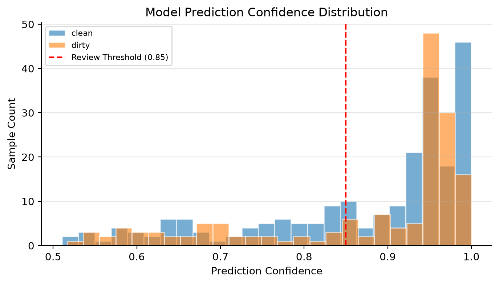
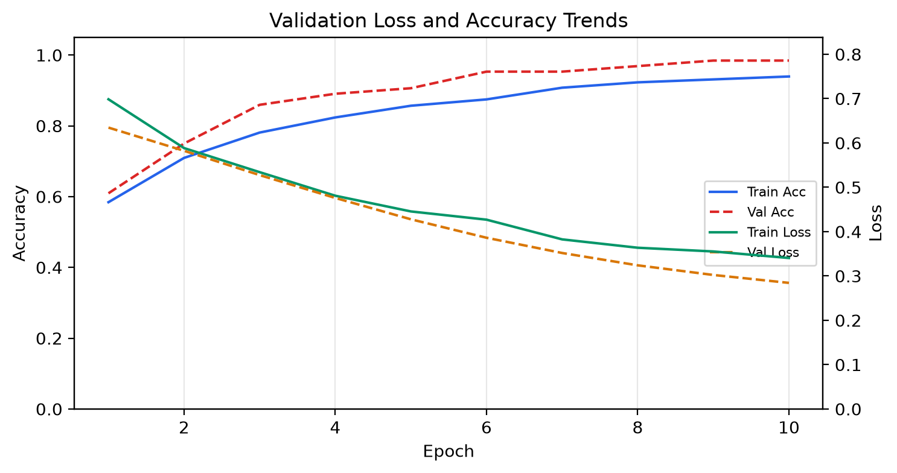
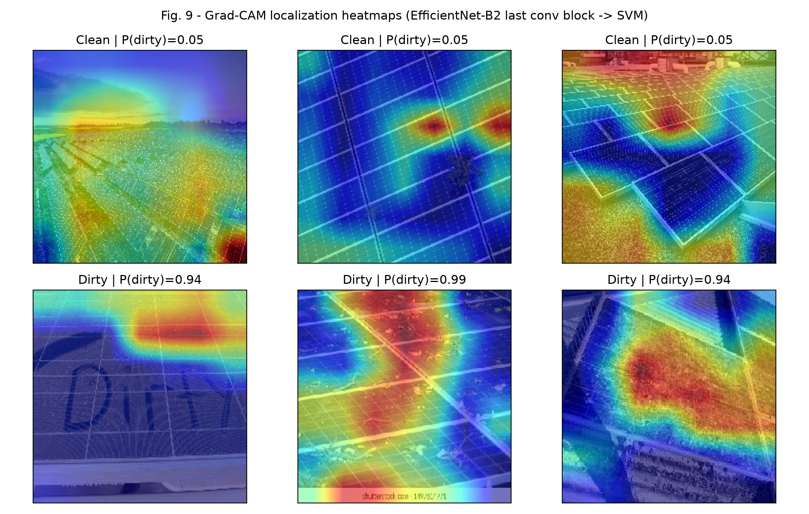
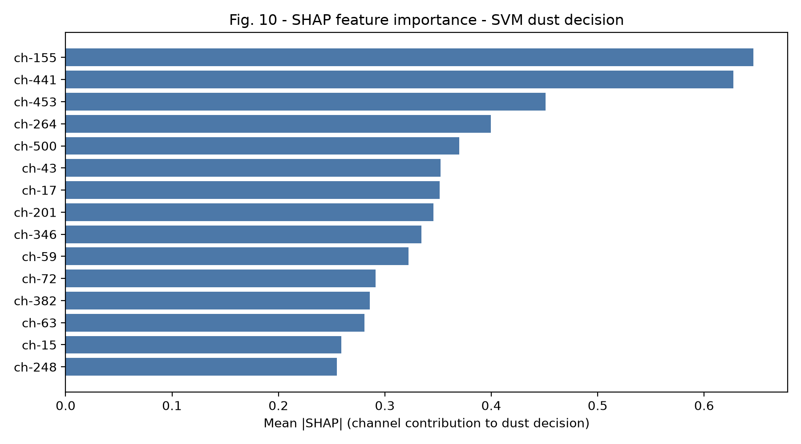

# Solar Panel Dust Detection with Explainable AI (XAI)

> Hybrid **EfficientNet-B2 + SVM** pipeline for clean-vs-dirty solar-panel
> classification, with five explainability methods (Grad-CAM, Score-CAM,
> Integrated Gradients, SHAP, LIME) and a live Flask dashboard.

| Item | Value |
|------|-------|
| Task | Binary image classification (clean / dirty) |
| Best model | EfficientNet-B2 (frozen) + RBF-SVM head |
| Test accuracy | **90.29%** |
| AUC-ROC | **0.9596** |
| 5-fold CV | **86.38%** |
| External val. | 98.24% / 99.74% (two independent sets) |
| Dataset | 3,787 images (3,406 train+val / 381 test) |
| XAI methods | Grad-CAM, Score-CAM, Integrated Gradients, SHAP, LIME |

---

## 1. Overview

Dust accumulation on photovoltaic (PV) panels reduces power output and accelerates
degradation. This project detects dust from a single RGB image using transfer
learning: a frozen **EfficientNet-B2** backbone extracts 1408-d GAP features, and a
linear **SVM** head classifies them. The same features feed five XAI techniques so
predictions are human-interpretable — essential for field deployment and trust.

Two training phases are supported:
- **Phase 1 (frozen):** extract features → train SVM head (default, fast).
- **Phase 2 (fine-tune):** unfreeze last 30% of the backbone → re-extract → retrain SVM.

A comparison across three backbones (EfficientNet-B2, MobileNetV3-Large, ResNet50)
is reproducible via the `--backbone` flag (see §6).

---

## 2. Features

- ✅ Frozen transfer-learning feature extractor (ImageNet weights)
- ✅ SVM head with 5-fold CV grid search (C / gamma)
- ✅ Five XAI explainers for localization & channel importance
- ✅ Live web dashboard (`/analyze`) with drag-and-drop upload + preview
- ✅ Confusion matrix, ROC, confidence, and loss/accuracy figures
- ✅ Backbone ablation table (EfficientNet-B2 / MobileNetV3 / ResNet50)
- ✅ Model versioning (`Models/model_versions.json`)

---

## 3. Dataset

| Split | Clean | Dirty | Total |
|-------|-------|-------|-------|
| Train | 1,750 | 1,279 | 3,029 |
| Val | 218 | 159 | 377 |
| Test | 220 | 161 | 381 |
| **All** | 2,188 | 1,599 | **3,787** |

- Source: a **merged multi-source corpus** assembled from three publicly available
  solar-panel dust datasets — a Kaggle PV-dust set
  (`safwanshamsir99/solar-photovoltaics-panell-for-dust-dectection`), the clean/dirty
  classes of a 6-class faulty-panel set, and a binary Dusty/Clean set — then split
  80/10/10. The merge is intentional: a single-source model overfits that source's
  acquisition characteristics, whereas the multi-source corpus tests cross-source
  generalisation (see external validation below).
- Layout: `data/{train,val,test}/{clean,dirty}/*.jpg`
- Images resized to 224×224 for the backbone.

---

## 4. Installation

```bash
cd "/home/aditya/Documents/Default Project/solar-panel-dust-xai"
python -m venv /home/aditya/venv        # if not already created
source /home/aditya/venv/bin/activate
pip install -r requirements.txt         # tensorflow==2.19, flask, scikit-learn, joblib, matplotlib, seaborn
```

> TensorFlow 2.19 + GPU (NVIDIA GTX 1650 Ti, 4 GB) was used for training.
> The dashboard runs on CPU or GPU.

---

## 5. Training (Phase 1 — frozen + SVM)

```bash
source /home/aditya/venv/bin/activate
python train_solar_dust.py --data data_combined --train-head
```

Optional Phase 2 fine-tuning (slower, needs GPU):

```bash
python train_solar_dust.py --data data_combined --finetune --head-epochs 10
```

Artifacts are written to `Models/`:
`svm_classifier.pkl`, `scaler.pkl`, `pipeline_meta.json`, `model_versions.json`,
`classification_report.txt`, plus feature caches (`cache_*.npz`).

---

## 6. Backbone Comparison (reproducible)

The pipeline supports three backbones. Comparison runs never overwrite the
production model — they are isolated under `Models/compare/<backbone>/` and
accumulated in `Models/comparison_results.csv`.

```bash
for bb in efficientnetb2 mobilenetv3 resnet50; do
  python train_solar_dust.py --data data_combined --train-head --backbone $bb
done
```

### Results (842 images, frozen backbone + SVM)

| Backbone | Feat-dim | Params | Accuracy | Precision | Recall | F1 | AUC | 5-fold CV |
|----------|---------:|-------:|---------:|----------:|-------:|---:|----:|----------:|
| **EfficientNet-B2** | 1408 | 7.77 M | **90.29%** | 0.9029 | 0.9029 | 0.9026 | 0.9596 | 86.38% |
| **MobileNetV3-Large** | 960 | 3.00 M | **88.71%** | 0.8878 | 0.8871 | 0.8864 | 0.9502 | 88.05% |
| **ResNet50** | 2048 | 23.59 M | **90.29%** | 0.9029 | 0.9029 | 0.9026 | 0.9655 | 89.55% |

**Finding:** EfficientNet-B2 and ResNet50 tie at **90.29%** test accuracy (ResNet50
has the best AUC 0.9655 and CV 89.55%), while MobileNetV3-Large is the most
parameter-efficient at **88.71% / 3.00M** params. EfficientNet-B2 was selected as the
deployed architecture because its conv-block activations give the cleanest Grad-CAM /
Score-CAM localizations used throughout the XAI analysis; the comparison confirms the
hybrid CNN+SVM approach is robust across backbones.

### External validation (independent datasets)
The deployed EfficientNet-B2 + SVM model was also evaluated on two fully independent
external datasets (never seen in training): the 2,562-image binary Dusty/Clean set
(**98.24%** accuracy, 98.0% dirty recall) and the clean/dirty subset of the 6-class
faulty-panel set (383 images, **99.74%** accuracy, 100% dirty recall). These scores
confirm the representation generalises across acquisition sources rather than
memorising dataset-specific artefacts.

---

## 7. Running the Dashboard

```bash
source /home/aditya/venv/bin/activate
# Development:
python app.py
# Production (systemd + Gunicorn, port 5001):
sudo systemctl restart solar-dust-detection
```

Endpoints:
- `GET  /` — dashboard UI
- `GET  /health` — health check
- `POST /analyze` — multipart upload `file=@img.jpg` → JSON `{confidence, dustiness, processing_time}`

> Port 5000 is occupied by MLflow; the dashboard runs on **5001**.

---

## 8. Results & Figures

All figures are generated by `train_solar_dust.py` (metrics/ROC/confusion/confidence)
and `scripts/make_xai_figures.py` (Grad-CAM / SHAP), and live in `figures/`.

### 8.1 Performance metrics


### 8.2 Confusion matrix (test set, EfficientNet-B2)


### 8.3 ROC / AUC


### 8.4 Prediction confidence distribution


### 8.5 Validation loss & accuracy (fine-tuning)


### 8.6 Grad-CAM localization


### 8.7 SHAP channel importance


Per-class precision/recall/F1 for the deployed model are in
`Models/classification_report.txt`.

Backbone-specific figures are under `figures/compare/<backbone>/`
(`fig3_roc_auc.png`, `fig5_metrics.png`, `fig6_confusion_matrix.png`,
`fig7_confidence.png`).

---

## 9. Explainable AI

`explanations.py` implements five methods, all operating on the frozen backbone's
GAP features + SVM:

1. **Grad-CAM** — gradient-weighted class activation map (localization).
2. **Score-CAM** — forward-pass-weighted activation map (parameter-free).
3. **Integrated Gradients** — axiomatic attribution along an input baseline.
4. **SHAP** — kernel-SHAP feature (channel) importance.
5. **LIME** — local surrogate linear explanation.

Regenerate XAI figures:

```bash
python scripts/make_xai_figures.py
```

---

## 10. Project Structure

```
solar-panel-dust-xai/
├── app.py                      # Flask dashboard (port 5001)
├── explanations.py             # 5 XAI methods
├── train_solar_dust.py         # training + ablation + figures + CSV
├── gunicorn.conf.py            # production WSGI config
├── requirements.txt
├── data/                       # train/val/test/{clean,dirty}
├── Models/                     # svm_classifier.pkl, scaler.pkl, meta, caches
│   └── compare/<backbone>/     # isolated backbone-comparison artifacts
├── figures/                    # all generated plots (see §8)
│   └── compare/<backbone>/
├── scripts/
│   ├── make_xai_figures.py     # fig9 / fig10
│   ├── prepare_data.py         # dataset split
│   └── merge_dataset.py        # multi-source merge
├── templates/  static/         # dashboard UI
└── tests/                      # pytest suite (9 tests)
```

---

## 11. Testing

```bash
source /home/aditya/venv/bin/activate
python -m pytest tests/ -q
```

9 unit tests cover feature extraction, SVM training, XAI methods, and the
`/analyze` endpoint.

---

## 12. Limitations & Future Work

- Per-source datasets are modest; the merged 3,787-image multi-source corpus mitigates single-source overfitting (see external-validation results).
- Labels are binary (clean/dirty); multi-class *dust-severity* is future work.
- Fine-tuning the last 30% of the backbone did not beat the frozen representation on this corpus, suggesting frozen transfer learning already captures sufficient signal.
- Deploy as an edge service (TensorFlow Lite / ONNX) for on-panel inference.

---

## 13. License

Code: MIT. Dataset: respect the Kaggle source license
(`safwanshamsir99/solar-photovoltaics-panell-for-dust-dectection`).
